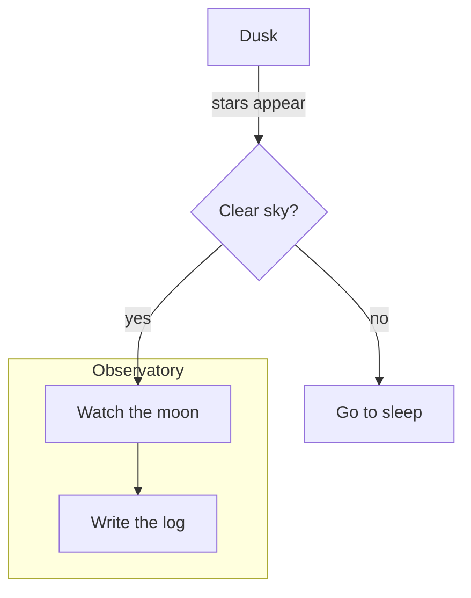
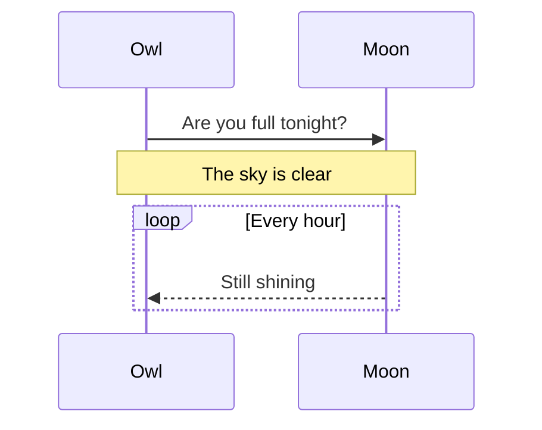
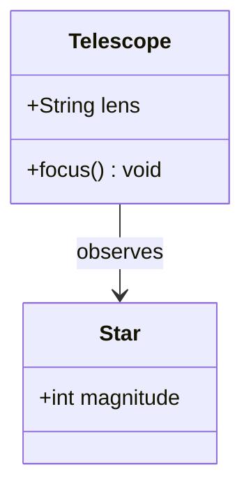
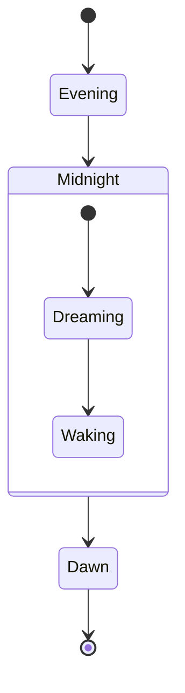
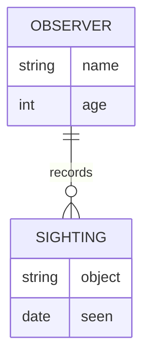
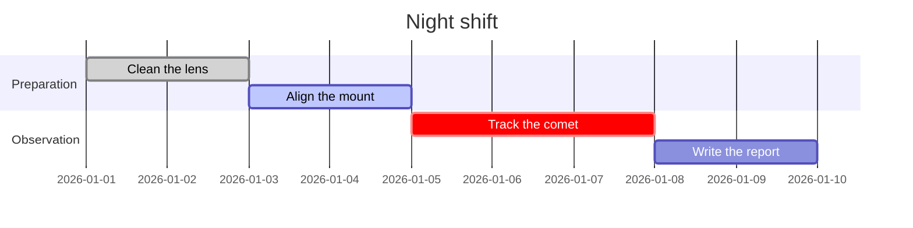
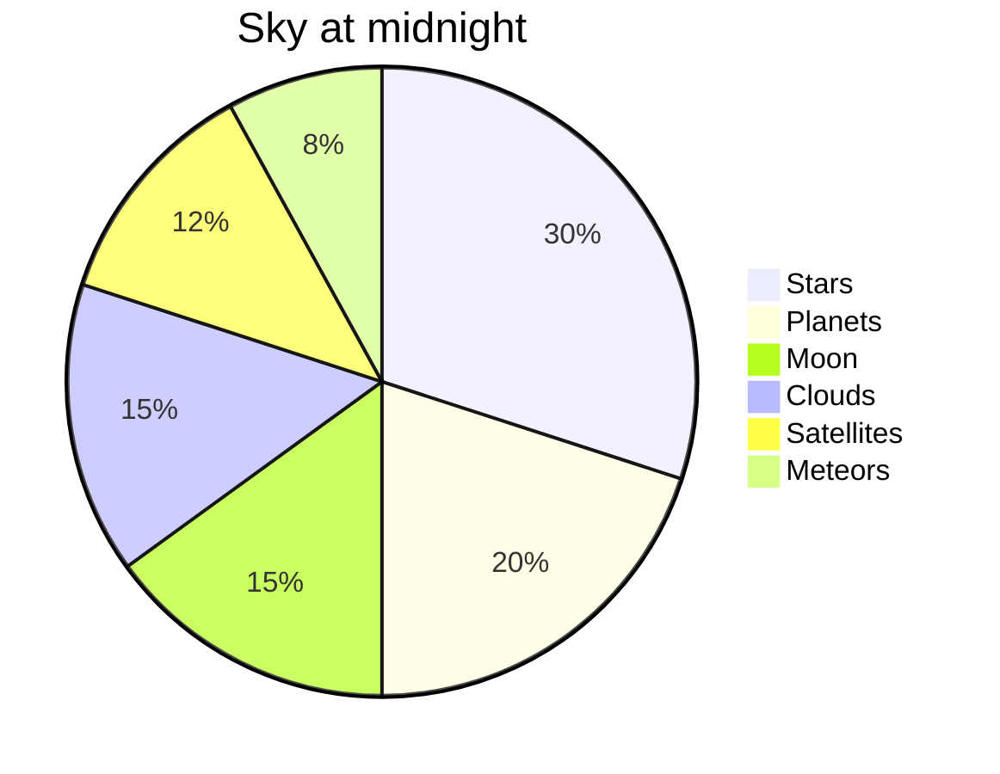
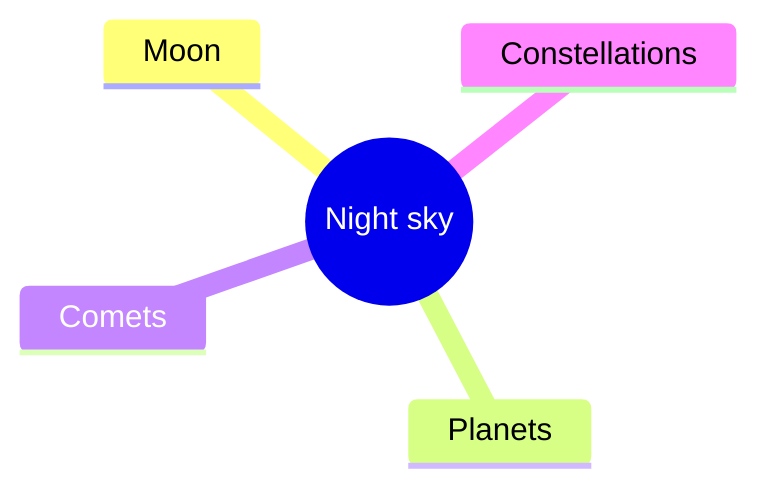

# Moonlit diagrams

## Flowchart

```mermaid
flowchart TD
  Dusk[Dusk] -->|stars appear| Night{Clear sky?}
  Night -->|yes| Watch[Watch the moon]
  Night -->|no| Sleep[Go to sleep]
  subgraph Observatory
    Watch --> Log[Write the log]
  end
```

## Sequence

```mermaid
sequenceDiagram
  participant Owl
  participant Moon
  Owl->>Moon: Are you full tonight?
  Note over Owl,Moon: The sky is clear
  loop Every hour
    Moon-->>Owl: Still shining
  end
```

## Class

```mermaid
classDiagram
  class Telescope {
    +String lens
    +focus() void
  }
  class Star {
    +int magnitude
  }
  Telescope --> Star : observes
```

## State

```mermaid
stateDiagram-v2
  [*] --> Evening
  Evening --> Midnight
  state Midnight {
    [*] --> Dreaming
    Dreaming --> Waking
  }
  Midnight --> Dawn
  Dawn --> [*]
```

## Entity relationship

```mermaid
erDiagram
  OBSERVER ||--o{ SIGHTING : records
  OBSERVER {
    string name
    int age
  }
  SIGHTING {
    string object
    date seen
  }
```

## Gantt

```mermaid
gantt
  title Night shift
  dateFormat YYYY-MM-DD
  section Preparation
  Clean the lens :done, a1, 2026-01-01, 2d
  Align the mount :active, a2, after a1, 2d
  section Observation
  Track the comet :crit, b1, after a2, 3d
  Write the report :b2, after b1, 2d
```

## Pie

```mermaid
pie title Sky at midnight
  "Stars" : 30
  "Planets" : 20
  "Moon" : 15
  "Clouds" : 15
  "Satellites" : 12
  "Meteors" : 8
```

## Mindmap

```mermaid
mindmap
  root((Night sky))
    Moon
    Planets
    Comets
    Constellations
```
