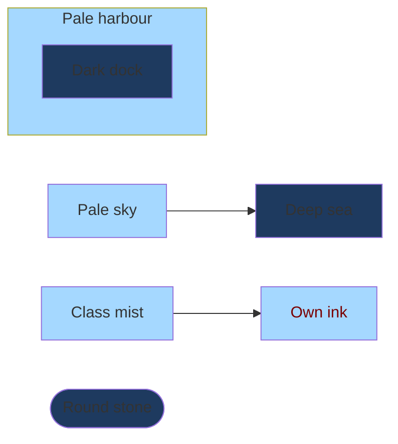

# Painted diagrams

```mermaid
flowchart LR
  classDef pale fill:#a5d8ff
  Sky[Pale sky] --> Sea[Deep sea]
  Mist[Class mist]:::pale --> Ink[Own ink]
  Stone([Round stone])
  subgraph Harbour [Pale harbour]
    Dock[Dark dock]
  end
  style Sky fill:#a5d8ff
  style Sea fill:#1e3a5f
  style Ink fill:#a5d8ff,color:#7a0000
  style Stone fill:#1e3a5f
  style Harbour fill:#a5d8ff
  style Dock fill:#1e3a5f
```
